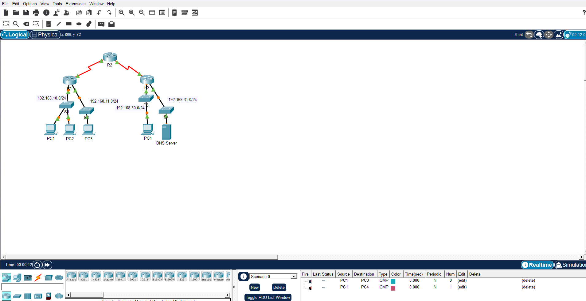
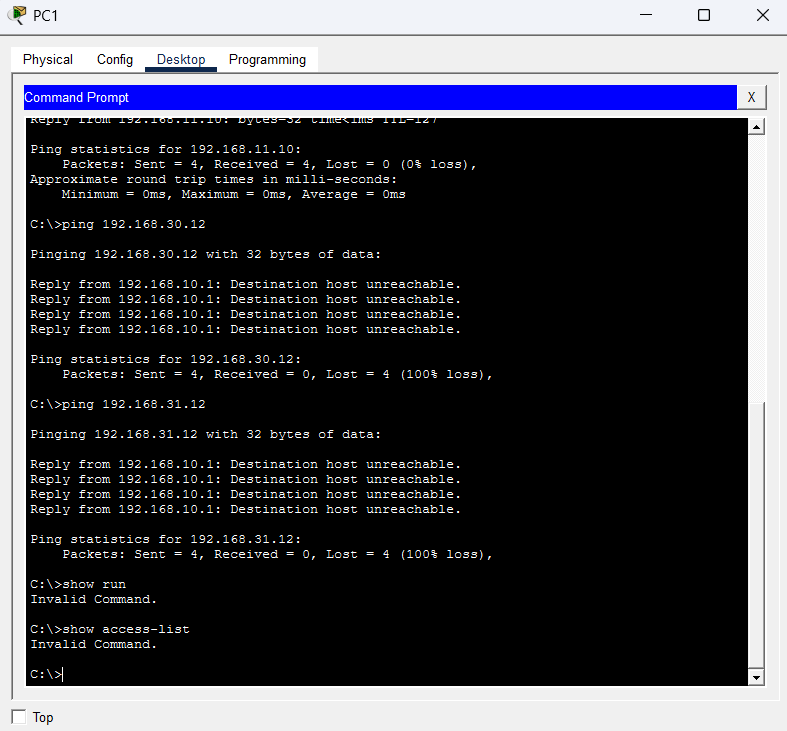
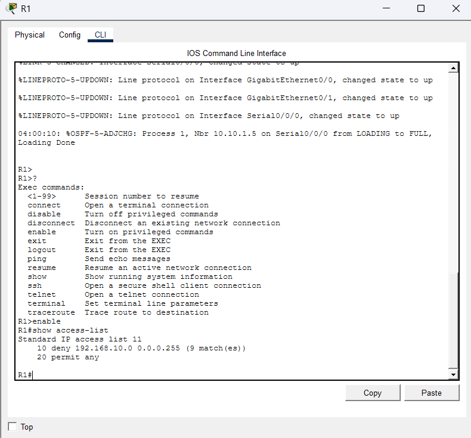
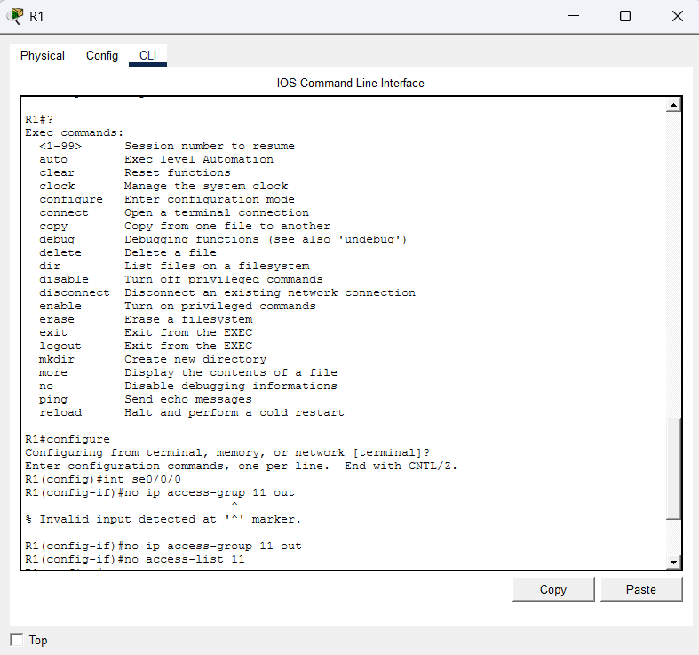
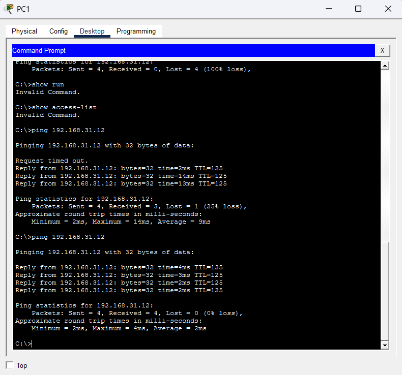

# Packet Tracer: Demonstração de ACL

Lab da Cisco Networking Academy sobre como uma ACL (lista de controle de acesso) pode bloquear pings entre redes, e o que muda quando ela é removida.

## Objetivos

- Parte 1: verificar a conectividade local e testar a ACL
- Parte 2: remover a ACL e repetir o teste

## Topologia

Três roteadores (R1, R2 e R3) ligados em série, com quatro redes locais:

- 192.168.10.0/24: PC1 e PC2 (atrás do R1)
- 192.168.11.0/24: PC3 (atrás do R1)
- 192.168.30.0/24: PC4 (atrás do R3)
- 192.168.31.0/24: DNS Server (atrás do R3)



## Parte 1: testando com a ACL ativa

### Etapa 1: conectividade local

Do PC1, o ping para o PC2 e para o PC3 funcionou. As camadas 1 a 3 estão funcionando e não existe nenhum filtro de ICMP entre essas redes locais.

### Etapa 2: ping para redes remotas

Do PC1, o ping para o PC4 (192.168.30.12) e para o DNS Server (192.168.31.12) falhou nos dois casos, com 100% de perda e a resposta "Destination host unreachable" vinda de 192.168.10.1 (o gateway, ou seja, o R1).

Ou seja, o pacote chegou no R1 e foi barrado ali.



## Parte 2: investigando e removendo a ACL

### Etapa 1: vendo a ACL no R1

No R1, com o `show access-list`:

```
R1# show access-list
Standard IP access list 11
    10 deny 192.168.10.0 0.0.0.255 (9 match(es))
    20 permit any
```

- Linha 10: nega qualquer pacote com origem na rede 192.168.10.0/24 (incluindo os pings). O contador mostra que 9 pacotes já foram barrados.
- Linha 20: permite todo o resto do tráfego IP.

A ACL 11 está aplicada na interface Serial0/0/0 do R1, no sentido de saída (out). Por isso o tráfego da rede 192.168.10.0 não passa para o outro roteador, mas a comunicação local continua normal.



### Etapa 2: removendo a ACL

Primeiro removi a ACL da interface e depois apaguei ela da configuração global. Errei a digitação na primeira tentativa (`access-grup` em vez de `access-group`) e o IOS retornou `% Invalid input detected`. Corrigi e funcionou:

```
R1# configure terminal
R1(config)# int se0/0/0
R1(config-if)# no ip access-group 11 out
R1(config-if)# exit
R1(config)# no access-list 11
```



### Etapa 3: testando de novo

Do PC1, o ping para o DNS Server (192.168.31.12) passou a funcionar. Na primeira tentativa teve 1 pacote perdido (25% de perda, normal no primeiro ping por causa do ARP). Na segunda, 0% de perda, com TTL 125 (o pacote atravessou os roteadores).



## Conclusão

- A ACL padrão 11 bloqueava a rede 192.168.10.0/24 na saída da Serial0/0/0 do R1.
- Uma ACL só tem efeito depois de aplicada em uma interface, com um sentido definido.
- Removendo o `ip access-group` da interface e o `access-list` da configuração global, o tráfego voltou a passar.

## Comandos usados

- `show access-list`
- `show run`
- `interface serial 0/0/0`
- `no ip access-group 11 out`
- `no access-list 11`
- `ping`
