# Packet Tracer: Investigando um Cenário de Ameaças

Lab de cibersegurança do Cisco Packet Tracer com três cenários de vulnerabilidade: configuração incorreta de rede, phishing com ransomware e Evil Twin com DNS spoofing.

> Ambiente simulado, feito apenas para fins educacionais.

## Objetivos

- Investigar uma vulnerabilidade de configuração de rede
- Investigar uma vulnerabilidade de malware por phishing
- Investigar uma vulnerabilidade de rede sem fio e DNS

## Ferramentas

- Cisco Packet Tracer

---

## Parte 1: Vulnerabilidade de configuração de rede

Cenário: uma rede doméstica com rede Wi-Fi de convidados (Guest) aberta. Uma pessoa conectada nessa rede consegue alcançar dispositivos da rede local, como uma webcam.

### Acesso à webcam pela rede de convidados

Do Smartphone 3, conectado na rede Guest, o ping para a webcam (192.168.100.101) foi respondido com 0% de perda. Ou seja, a rede de convidados não está isolada da rede local.

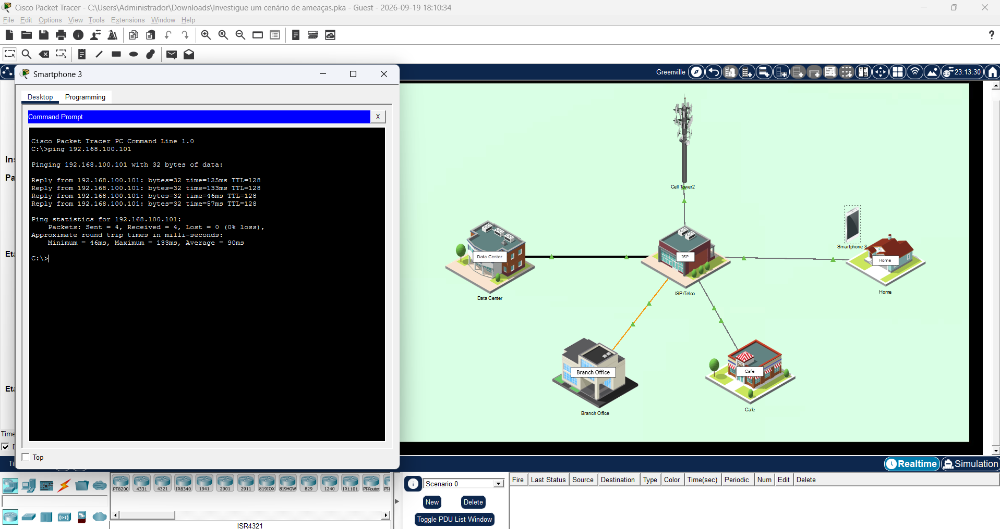

### Análise do roteador

Acesso ao roteador pelo gateway padrão (192.168.100.1), com as credenciais padrão do fabricante (`admin` / `admin`).

- 3 rádios ativos: 2.4 GHz, 5 GHz-1 e 5 GHz-2
- SSIDs: `HomeNet` (2.4 GHz e 5 GHz-2) e `Guest` (5 GHz-1)

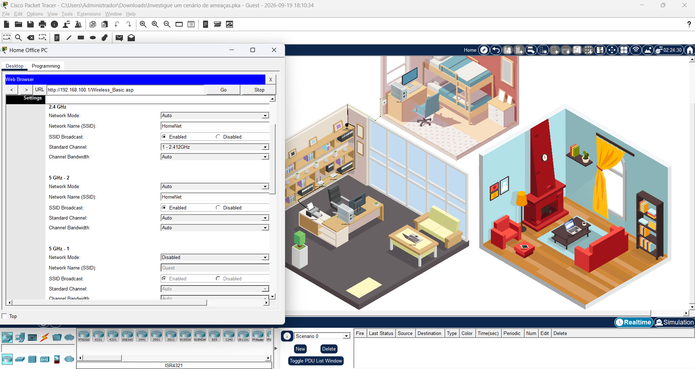

Na aba de segurança, os rádios 2.4 GHz e 5 GHz-2 usam WPA2 Personal com AES. O rádio 5 GHz-1, da rede Guest, está com a segurança desabilitada.

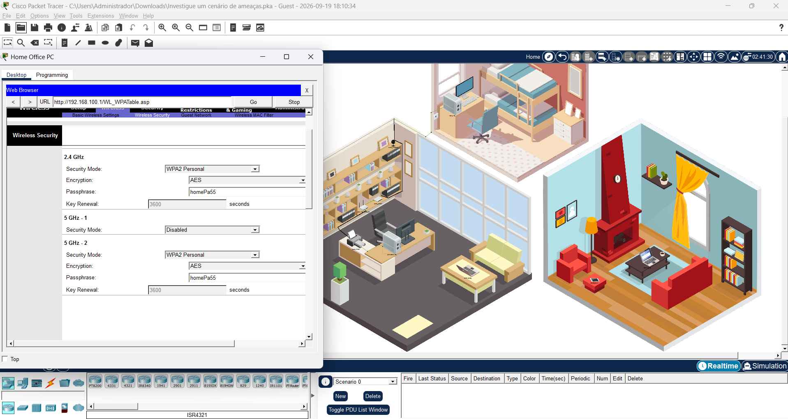

A rede Guest está ativa no rádio 5 GHz-1, com o SSID transmitido e sem segurança. A opção que permite aos convidados acessar a rede local está marcada, o que explica o acesso à webcam.

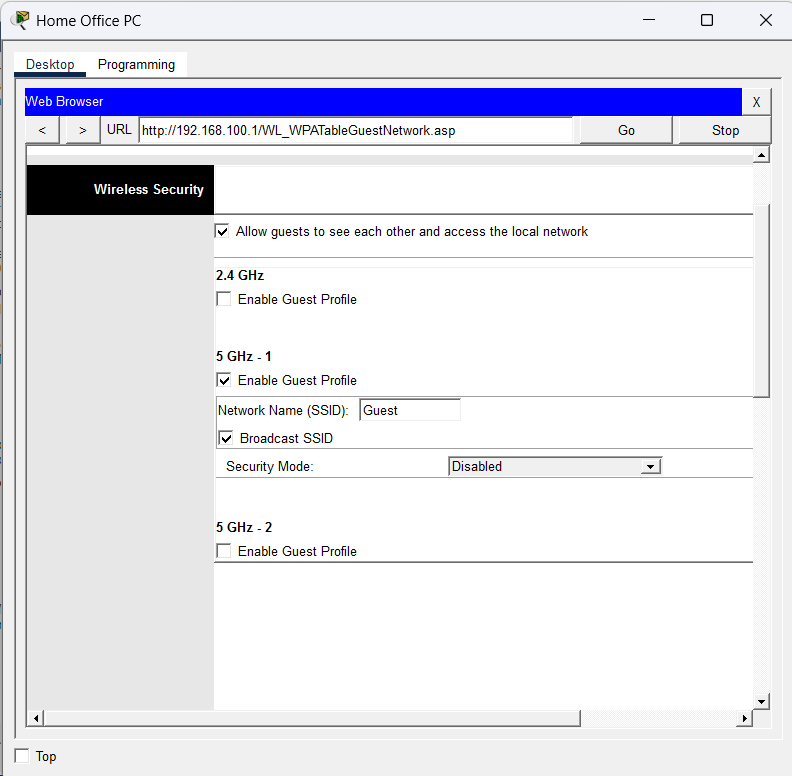

### Vulnerabilidades encontradas

- Rede Guest sem senha
- Rede Guest sem isolamento da rede local
- Roteador com credenciais padrão

### Correção sugerida

- Ativar WPA2 na rede Guest (ou desativar a rede)
- Desmarcar a opção que permite aos convidados acessar a rede local
- Trocar as credenciais padrão do roteador

---

## Parte 2: Phishing e ransomware

Simulação de um ataque de phishing: um e-mail falso, se passando por um banco, é enviado do Cafe Hacker Laptop para usuários da rede Filial. O link do e-mail leva a um servidor malicioso.

### Criação do e-mail

E-mail com assunto de urgência ("Sua conta será bloqueada em 24 horas"), remetente falso e um link para `pix.example.com`.

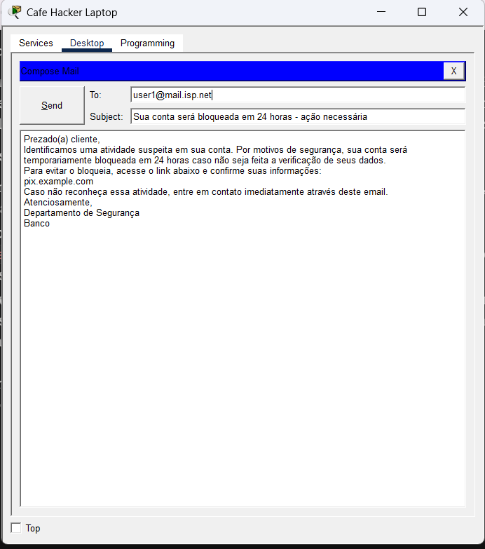

### Recebimento pela vítima

O e-mail chegou na caixa de entrada do PC-BR1, na rede Filial.

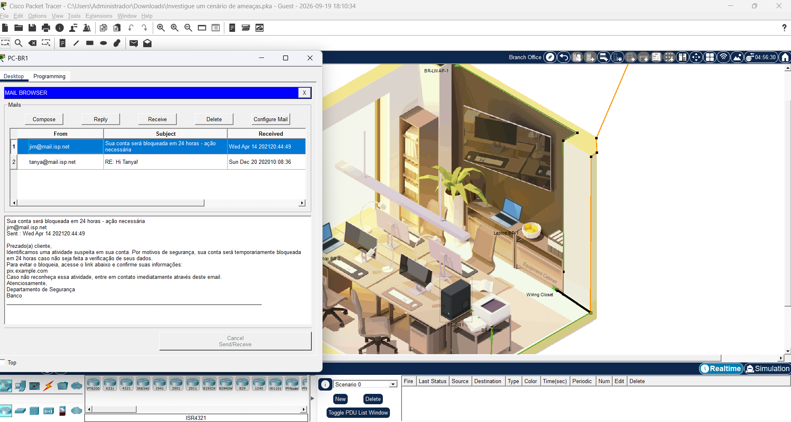

### Resultado

Ao abrir o endereço do e-mail no navegador, a vítima cai numa página de ransomware avisando que os arquivos foram criptografados e pedindo pagamento.

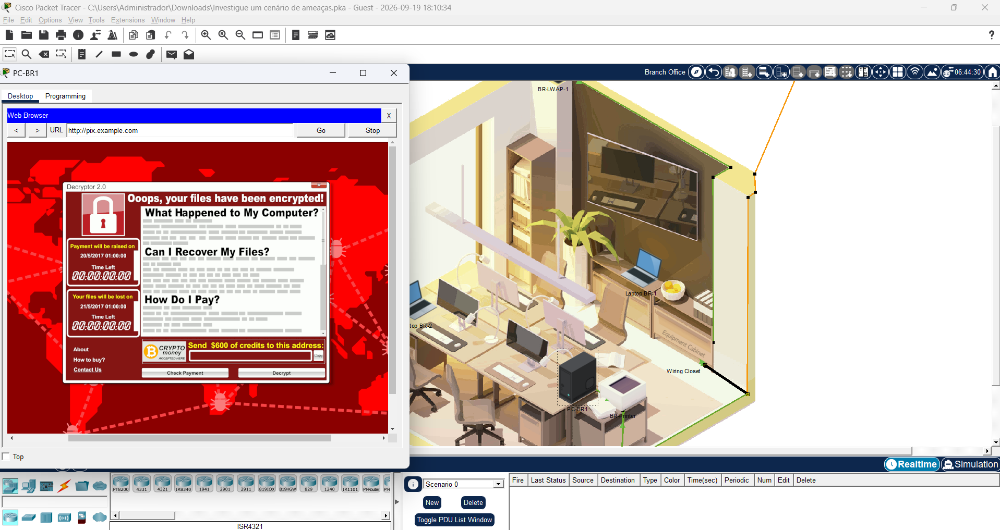

**Tipo de ataque:** ransomware distribuído por phishing.

**Impacto em uma empresa:** perda de dados, gasto com resgate, dias ou semanas de operação parada, perda de credibilidade com clientes e risco real de encerrar as atividades.

**Mitigação:**

- Treinamento de usuários para reconhecer phishing
- Firewalls e sistemas de prevenção de intrusão (IPS)
- Listas de sites maliciosos atualizadas automaticamente nos filtros de segurança

---

## Parte 3: Evil Twin e DNS spoofing

Cenário: uma cafeteria com Wi-Fi público, onde um atacante criou um access point falso com nome parecido com o da rede legítima.

### Redes disponíveis

Na lista de redes, aparecem três redes `Cafe_WIFI_FAST` (sinal de 73% a 78%, sem segurança) ao lado da rede legítima `Cafe_WiFi` (sinal de 66%). O nome parecido e o sinal mais forte tornam as falsas mais atrativas para quem não presta atenção.

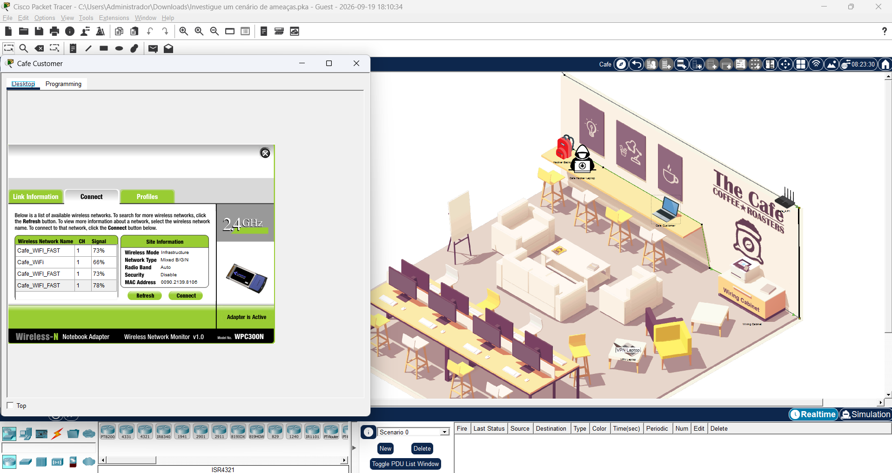

### Resultado

Conectado na rede falsa, ao acessar `friends.example.com` (site legítimo na simulação), o tráfego é redirecionado para o servidor malicioso e a página de ransomware aparece.

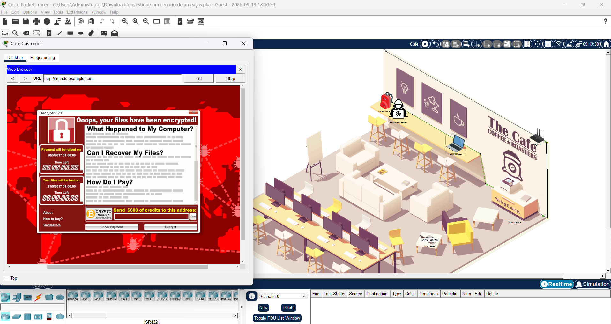

### Investigação da origem

Comparando o Cafe Customer (na rede falsa) com o VPN Laptop (na rede legítima):

| | Cafe Customer | VPN Laptop |
|---|---|---|
| IPv4 | 192.168.10.200 | 192.168.0.12 |
| Gateway | 192.168.10.198 | 192.168.0.5 |
| Servidor DNS | 192.168.10.199 | 10.2.0.125 |

O servidor DNS do Cafe Customer (192.168.10.199) é o IP do próprio Cafe Hacker Laptop.

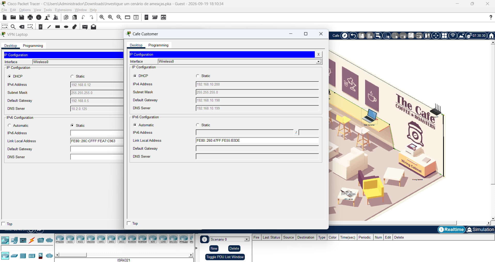

No serviço DNS do Cafe Hacker Laptop, o domínio `friends.example.com` aponta para `10.6.0.250`, o mesmo IP usado por `pix.example.com` no ataque de phishing.

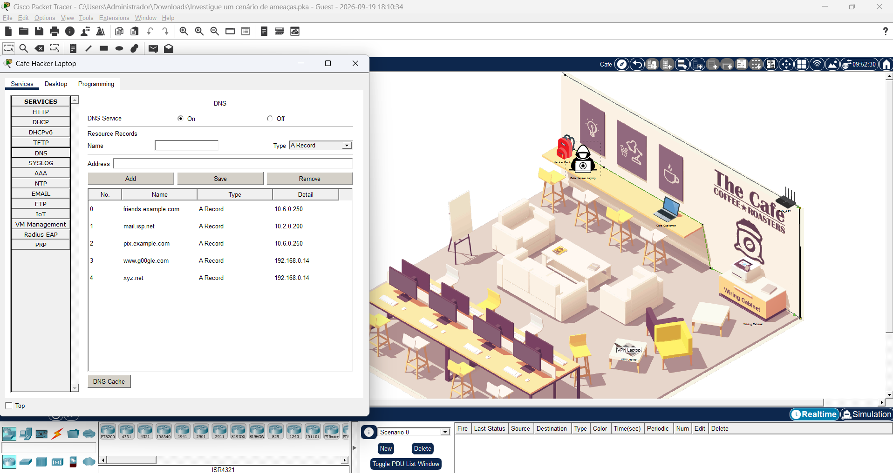

O serviço DHCP do Cafe Hacker Laptop é o responsável por entregar essa configuração para quem se conecta.

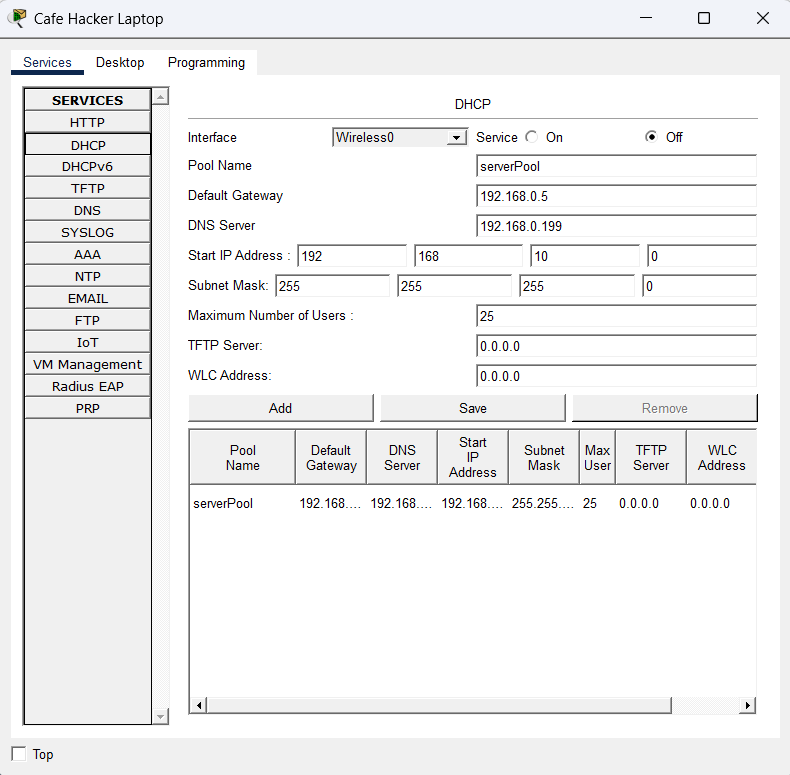

### Cadeia do ataque

1. A vítima se conecta ao access point falso
2. Recebe a configuração de rede via DHCP, com o DNS do atacante
3. O DNS malicioso resolve o site legítimo para o IP do servidor malicioso (`10.6.0.250`)
4. O tráfego é redirecionado e o ransomware é instalado

### Mitigação

- Desconfiar de redes abertas com nome parecido com o da rede oficial
- Preferir redes com segurança ativada e confirmar o nome da rede com o estabelecimento
- Usar VPN em redes públicas
- Conferir o servidor DNS recebido quando houver comportamento estranho

---

## Conclusão

O lab mostrou três formas de explorar vulnerabilidades: uma falha de configuração no roteador, a engenharia social por e-mail e um Evil Twin combinado com DNS spoofing. Nos dois últimos, o ponto de entrada foi o usuário, o que reforça a importância de treinamento e de cuidado ao se conectar em redes públicas.
