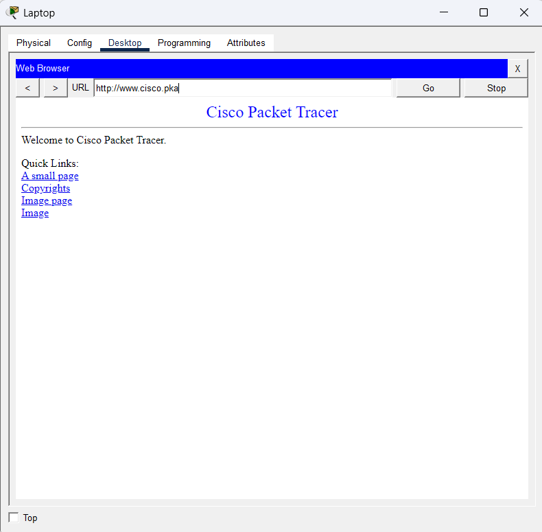
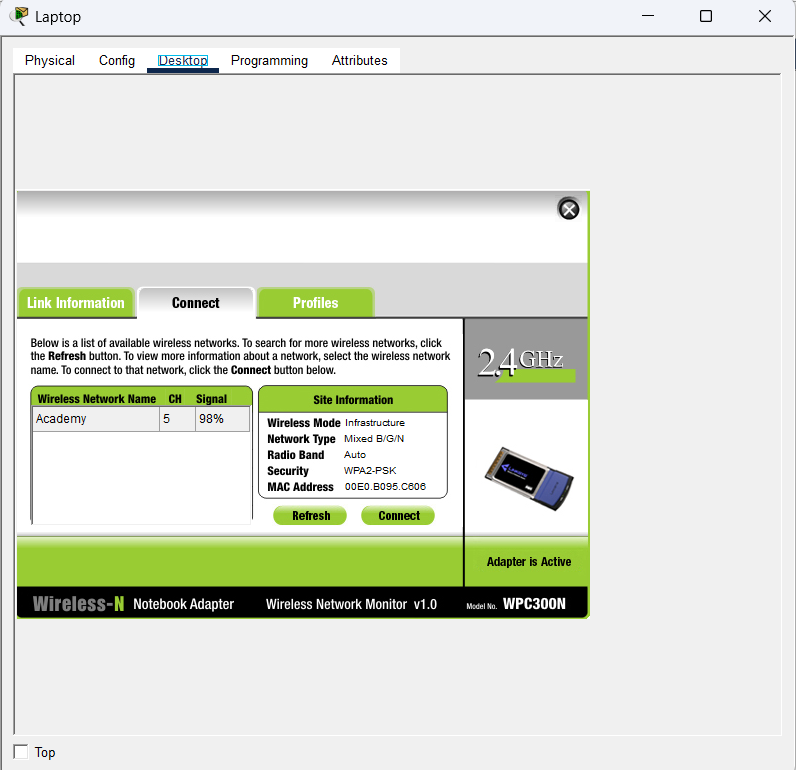
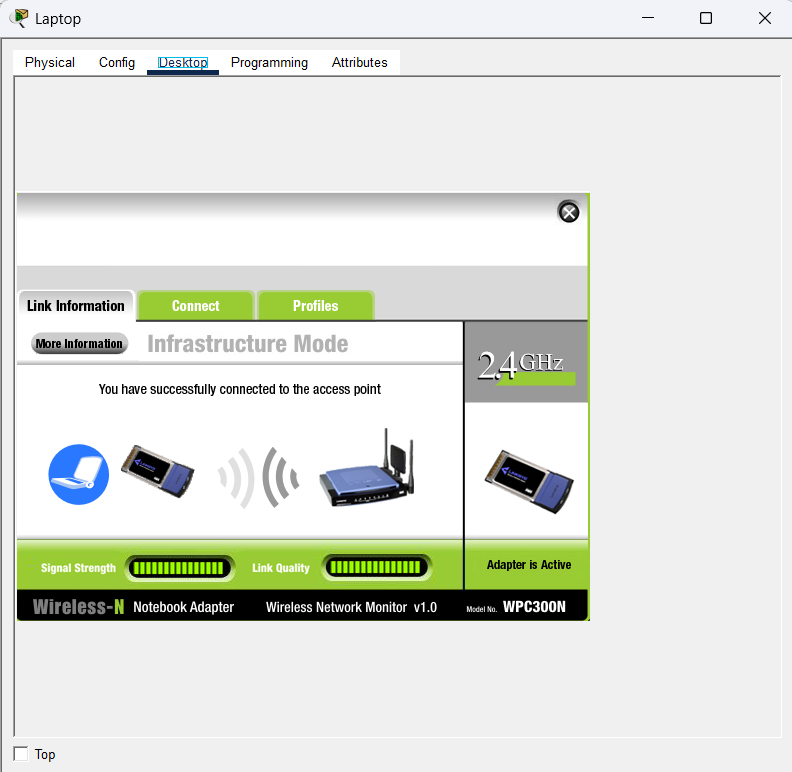
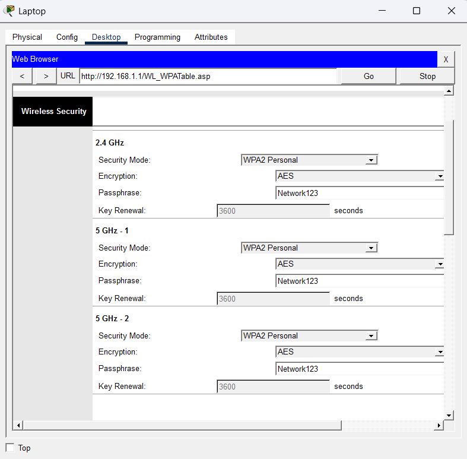
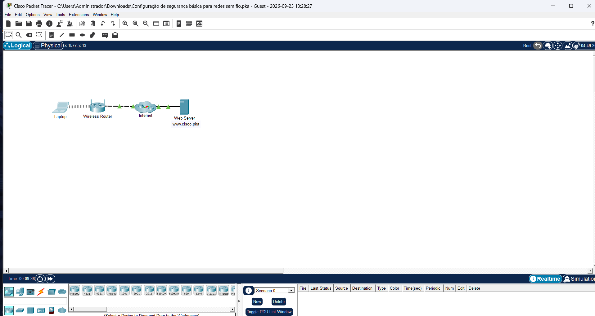

# Segurança básica para redes sem fio com WPA2 Personal (Packet Tracer)

Laboratório no Cisco Packet Tracer onde configurei a segurança de uma rede Wifi usando WPA2 Personal, saindo de uma rede aberta até um notebook conectado com senha e acessando um servidor web.

## Objetivo

Proteger uma rede sem fio contra acesso não autorizado, ativando criptografia e autenticação por senha no roteador wireless depois reconectando o cliente.

## Cenário

Uma pequena empresa percebeu que a rede Wifi estava aberta, sem nenhuma proteção. Por isso, o dono decidiu usar WPA2 Personal.

## Topologia

```
Laptop ~~~ Wireless Router --- Internet --- Web Server (www.cisco.pka)
```

- **Laptop:** cliente wireless (adaptador WPC300N)
- **Wireless Router:** access point, gateway `192.168.1.1`
- **Web Server:** `www.cisco.pka`

## O que foi feito

### 1. Verificação inicial de conectividade

Antes de mexer em qualquer coisa, abri www.cisco.pka no navegador do notebook para confirmar que a rede funcionava com a configuração original (sem segurança).

### 2. Configuração do WPA2 Personal no roteador

1. Acessei 192.168.1.1 pelo navegador do notebook e fiz login na interface do roteador.
2. Fui em **Wireless -> Wireless Security**.
3. O modo de segurança estava **desativado**, então alterei para **WPA2 Personal**.
4. Criptografia: **AES**.
5. Defini a frase secreta (passphrase) da rede.
6. Salvei as configurações.

Configuração final:

| Banda | Security Mode | Encryption |
|---|---|---|
| 2.4 GHz | WPA2 Personal | AES |
| 5 GHz - 1 | WPA2 Personal | AES |
| 5 GHz - 2 | WPA2 Personal | AES |

### 3. Reconexão do notebook

1. Abri **PC Wireless** na aba Desktop.
2. Na aba **Connect**, selecionei a rede **Academy** (canal 5, WPA2-PSK).
3. Inseri a passphrase configurada no roteador e conectei.
4. Na aba **Link Information**, confirmei a mensagem de conexão bem-sucedida com o access point.

### 4. Teste final

Abri novamente www.cisco.pka no navegador e a página carregou normalmente, confirmando que a rede continua funcionando, agora protegida.

## Resultado

- Rede sem fio protegida com **WPA2 Personal + AES**
- Notebook autenticado com a passphrase
- Conectividade com o servidor web validada depois da configuração

## Conceitos praticados 

- Diferença entre rede aberta e rede com WPA2
- Criptografia AES no Wifi
- Autenticação por chave pré-compartilhada (PSK)
- Configuração de roteador wireless pela interface web
- Teste de conectividade antes e depois de uma mudança

## Observações de segurança

Nesse lab a senha é simples porque o objetivo é didático. Em uma rede real, o ideal é:

- Usar uma passphrase longa e única
- Trocar a senha padrão de administração do roteador (`admin/admin` é inaceitável fora do lab)
- Considerar WPA3 quando o equipamento suportar
- Em ambiente corporativo, preferir WPA2/WPA3 Enterprise (802.1X) em vez de Personal

## Prints







## Ferramentas

- Cisco Packet Tracer
- Lab: *Configuração de segurança básica para redes sem fio* (Cisco Networking Academy)
